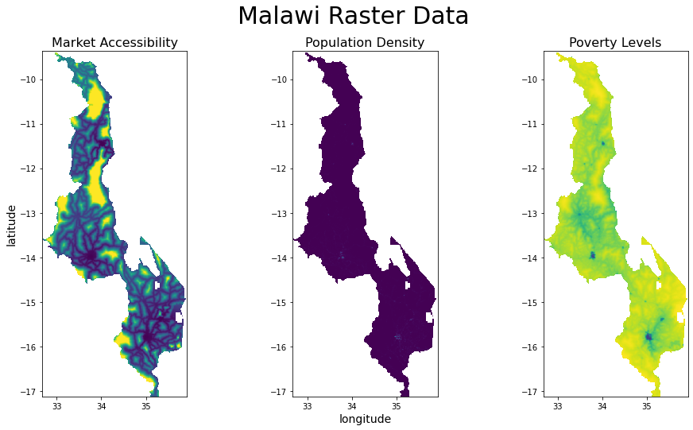
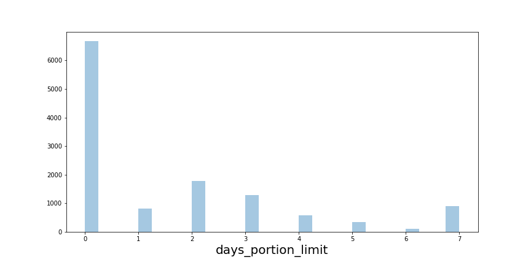
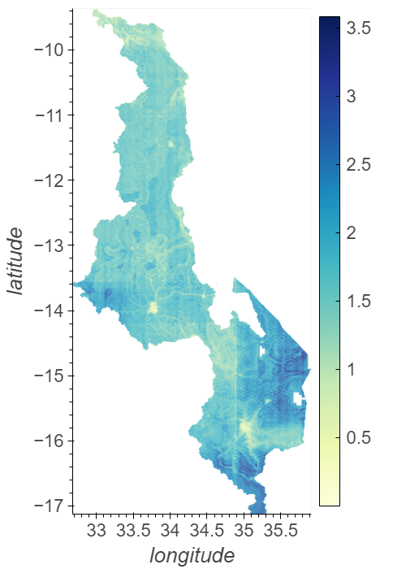

# Estimating the Geographic Distribution of Hunger in Malawi

## [Background](#background)
In this project we create a country-wide local estimation of the burden of hunger in the country of Malawi and evaluate the systematic error and statistical uncertainties of our model. The Malawian economy is one of the least developed in the world and faces persistent problems due to poor infrastructure and government corruption. Our goal is to create a model that will be useful for government and supporting organizations to address areas with the greatest need. 

## Methods
The burden of hunger is measured by the expected number of days/week that the average household at a given location is required to restrict meal portions. Our model is trained on survey data from over 12,000 households in 2016, along with their geographic coordinates, and is generalized to the rest of the country on the basis of local poverty levels, population density, and market access.

The geographic data was downloaded from the [RCMRD Geoportal](http://geoportal.rcmrd.org/), a platform which provides open source geospatial maps for eastern and southern Africa. They are stored as raster data which we read into numpy arrays.

The survey data is taken from the [Integrated Household Panel Survey](https://microdata.worldbank.org/index.php/catalog/3819/study-description) of Malawi performed in 2016 for the Living Standards Measurement Study (LSMS). A histogram of survey responses can be seen below.

We join this data using the geographic coordinates of the survey households and train a variety of machine learning models, including decision tree regressors, linear regressors, k-nearest neighbor regressors, and support vector machines to predict the days/week of portion resriction from the independent variables. Finally, we feed these models into a stacking regressor which lowers bias and reduced the chance of over-fitting. This done, we generalize the survey data to a local country-wide estimation by querying the value of the independent variables at each point in the country and performing a prediction with the model. 

## Results
The model's performance is evaluated using the mean-absolute-error (MAE) on a holdout set of validation data (40% of the collected survey data), which stands at about 0.6 days/week. In this context, where 11% of survey respondents report restricting portion sizes 5 days/week or more, we believe this MAE indicates a low level of systematic error, and that we have a have an effective model for diagnosing the level of need at a location and helping to set priorities for policy intervention. Statistical uncertainty is quantified by spatially varying confidence intervals depending on local conditions, computed using the bootstrap.

For the user's convenience, python functions are defined for querying the expected days/week with portion restrictions and the associated confidence intervals at arbirary longitude and latitude within Malawi. Results are summarized with an interactive map that shows these results on mouse-over.

## Usage

This project is best viewed in a notebook viewer, which can be accessed here. In this notebook, you will find a walk through of the work done and the respective code.
